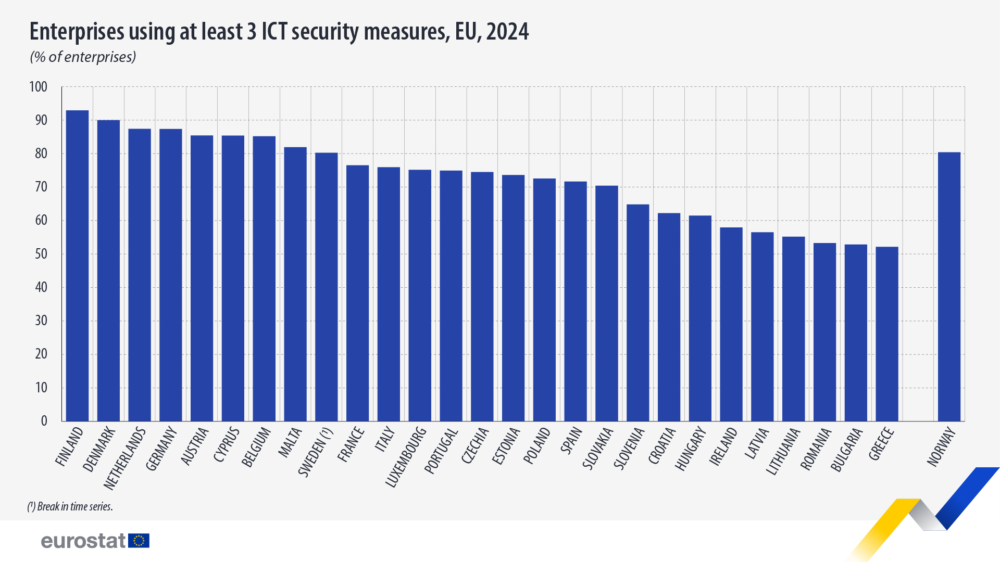
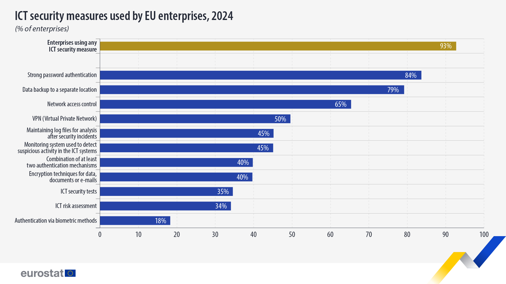

+++
title = "Greek companies have the weakest cybersecurity"
date = "2023-10-11T13:00:00+02:00" ## please change and see the T separates Date and Time
tags = ["Cybersecurity", "Greece"]
categories = ["all"]
description = "Greek companies have the weakest cybersecurity"
banner = "img/cs-aware.png"
authors = ["OTS"]
+++

Greek businesses have emerged as the weakest link in the European Union when it comes to cybersecurity, ranking last in terms of protective measures against cyberattacks. Just days after Kaspersky released data showing that Greece tops the list as the most dangerous online environment globally, Eurostat figures paint a grim picture of corporate cyber-readiness, placing Greek companies extremely low in the rankings.

According to the latest Eurostat data, while the majority of companies in the EU have implemented cybersecurity measures, disparities among member-states remain significant. Greek companies stand out negatively, being labeled as the weakest of Europe in terms of implementing cybersecurity protections.

In Greece, only 52% of businesses have adopted three or more cybersecurity measures, placing the country at the bottom of the EU list. Similar figures are found only in Romania and Bulgaria (53%). In contrast, companies in Finland (93%), Denmark (90%), and the Netherlands (87%) lead the way with extensive security policies, while Greek companies remain in the digital shadow, with rather inadequate security measures in place.

### A matter of time before a cyberattack

*“There are two types of companies: those that have been attacked and those that have, but don’t know it yet.”*

With this statement, the head of the National Cybersecurity Authority, mr. Michalis Bletsas, recently highlighted the severity of the issue, also noting that the reason Greece has not suffered a major cybersecurity incident yet is "because we’re a small and not very juicy target”.

Sources from within Greece’s cybersecurity ecosystem confirm a surge in attacks in 2024, most of which never reached the public domain. Mr. Bletsas has stated that many cyberattacks go unreported in Greece simply because organizations fail to realize they’ve been targeted.

Data from Check Point Software Technologies shows that Greek banks face around 757 cyberattacks per week, though industry insiders suggest the actual numbers are much higher.

### Most Common Cybersecurity Measures in the EU

According to Eurostat, 93% of EU businesses have implemented at least one measure to ensure the integrity, availability, and confidentiality of their data. The most common protections include:

- Strong password authentication (84%) – the most basic and almost universally applied security measure

- Backups in separate locations (79%) – essential for data recovery after an attack

- Network access controls (65%) – ensuring only authorized personnel can access critical systems

Despite rising cyber threats, the use of advanced technologies remains limited. For example, only 18% of companies use biometric authentication (for example facial or fingerprint recognition), mainly due to cost and technical challenges.

Incorporating cybersecurity measures remains a challenge, especially in smaller economies like Greece, where funding, expertise, and specialized personnel are in short supply. At the same time, increased reliance on digital systems makes businesses more vulnerable, while pushing the need for compliance with EU directives like NIS2.

### Greeks Among the Most Vulnerable Users Globally

Kaspersky's 2024 report, places Greece at the top of a global list of countries with the most dangerous online environments. More than 1 in 5 Greeks (22%) were targeted by at least one malware attack in the past year.

This troubling figure, based on attacks blocked by Kaspersky’s systems, ranks Greece as the most vulnerable among the top 20 most dangerous countries for internet use globally. Except for Slovakia, no other EU country appears on the list, with Greece faring worse than countries like Peru, Ecuador, Qatar, and Tunisia.

Equally alarming is the dramatic increase in cyberattacks on both individuals and companies in Greece during the past 12 months. In 2024 alone, Kaspersky blocked over 15.2 million online threats in Greece.

According to the same data:

- Ransomware attacks increased 10x, reaching 25,650 incidents

- Malware targeting banking data surged 25x, reaching 117,329 cases – only those detected and blocked by Kaspersky

Summing up, it is fair to say that Cyber Security, in Greece, remains a topic that hasn’t drawn the necessary attention yet.

Sources:

https://ec.europa.eu/eurostat/en/web/products-eurostat-news/w/ddn-20241212-1

https://ec.europa.eu/eurostat/databrowser/view/isoc_cisce_ra/default/table?lang=en

https://securelist.com/it-threat-evolution-q1-2024-pc-statistics/112754/

https://www.checkpoint.com/security-report/?flz-category=items&flz-item=report--cyber-security-report-2025